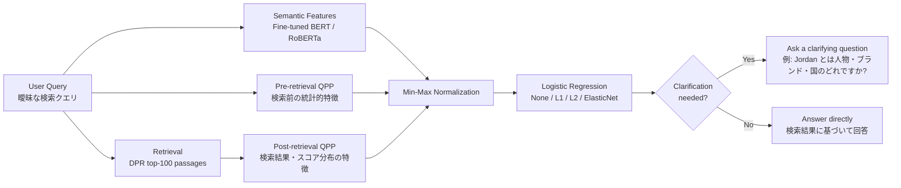

# QPP4SIP

**対話型検索で「そのまま答えるべきか、先に聞き返すべきか」を予測する研究リポジトリ**

このリポジトリは、対話型検索における **Clarification Need Prediction（CNP; 明確化必要性予測）** の実験を扱います。主眼は、プログラムそのものではなく、曖昧なクエリに対してシステムが明確化質問を行う必要があるかを、意味的特徴と検索有効性の両面から予測できるかを検証することです。

LLM や対話型検索システムは、曖昧な質問に対してもっともらしく推測して回答してしまう場合があります。本研究では、そのような過度な推測を避けるために、**クエリの意味的曖昧さ** と **検索システムから見た検索困難性** を統合し、明確化質問の要否を予測します。

## 研究の全体像

本研究の問いは単純です。

> BERT / RoBERTa のような事前学習済み言語モデルが捉える「意味的曖昧さ」と、QPP が捉える「検索の難しさ」は、明確化必要性予測において相補的に機能するのか。

## 背景

対話型検索では、ユーザーが最初から完全な検索意図を入力するとは限りません。たとえば “What was Jordan’s career?” というクエリは、Michael Jordan、Jordan という姓の人物、ブランド、国など複数の解釈を持ち得ます。

このような状況でシステムが一つの解釈を仮定して回答すると、誤った回答や不要な再検索につながります。一方で、すべてのクエリに対して明確化質問を行うと、対話効率が低下します。したがって、システムには **「聞き返すべきクエリ」と「直接答えてよいクエリ」を切り分ける能力** が必要です。

## 提案手法

本研究では、明確化必要性予測を二値分類タスクとして扱います。クエリに対して `y = 1` を「明確化が必要」、`y = 0` を「明確化不要」と定義し、複数の特徴量をロジスティック回帰で統合します。

### 1. 意味的特徴: Fine-tuned PLM

クエリ文そのものの意味的曖昧さを捉えるため、AmbigNQ の訓練データでファインチューニングした BERT / RoBERTa を用います。分類層から得られるスコアを、明確化必要性を表す意味的特徴として扱います。

### 2. Pre-retrieval QPP

検索を実行する前に、クエリと文書コレクションの統計量から検索困難性を推定する特徴量です。

| 指標 | 役割 |
| --- | --- |
| AvgICTF | クエリ語のコレクション内頻度に基づく希少性 |
| AvgIDF | クエリ語の平均 IDF |
| MaxIDF | クエリ内で最も希少な語の IDF |
| MaxSCQ | クエリ語とコレクションの類似性・変動性 |
| SCS | クエリと言語モデルの乖離 |

### 3. Post-retrieval QPP

検索実行後に得られるランキングやスコア分布から、検索結果の安定性や一貫性を推定する特徴量です。

| 指標 | 役割 |
| --- | --- |
| Clarity | 上位文書集合とコレクション全体の言語モデル差 |
| WIG | 上位文書スコアとコレクション平均スコアの差 |
| NQC | 上位文書スコアのばらつき |
| SMV | スコア平均と分散に基づく品質推定 |
| n(σ%) | トップスコア近傍の文書群に基づく標準偏差 |

### 4. 特徴量統合

各特徴量はスケールが異なるため、Min-Max 正規化で 0 から 1 の範囲に揃えたうえで、ロジスティック回帰に入力します。通常のロジスティック回帰に加え、QPP 指標間の多重共線性や過学習を考慮して、L1、L2、ElasticNet 正則化も比較します。

## 実験設定

| 項目 | 内容 |
| --- | --- |
| タスク | Clarification Need Prediction / 明確化必要性予測 |
| データセット | AmbigNQ |
| 正解ラベル | QA pairs が 1 つなら明確化不要、2 つ以上なら明確化必要 |
| 検索対象 | Wikipedia passages |
| 検索器 | DPR（Dense Passage Retrieval） |
| 検索結果 | 各クエリにつき上位 100 パッセージ |
| 意味的特徴 | Fine-tuned BERT, Fine-tuned RoBERTa |
| QPP 特徴 | Pre-retrieval QPP 5 種、Post-retrieval QPP 5 種 |
| 統合モデル | ロジスティック回帰 |
| 評価指標 | AUC-ROC |
| 統計的検定 | DeLong 検定、Holm 補正 |

## 結果

### 個別指標の性能

PLM は単体でも QPP 指標を大きく上回りました。一方で、QPP 指標は単体では限定的な性能に留まりました。

| カテゴリ | 指標 | AUC-ROC |
| --- | --- | ---: |
| Pre-retrieval QPP | AvgICTF | 0.5433 |
| Pre-retrieval QPP | AvgIDF | 0.5505 |
| Pre-retrieval QPP | MaxIDF | 0.5374 |
| Pre-retrieval QPP | MaxSCQ | 0.5409 |
| Pre-retrieval QPP | SCS | 0.5374 |
| Post-retrieval QPP | Clarity | 0.5007 |
| Post-retrieval QPP | NQC | 0.5348 |
| Post-retrieval QPP | SMV | 0.5368 |
| Post-retrieval QPP | WIG | 0.5535 |
| Post-retrieval QPP | n(σ%) | 0.5454 |
| Fine-tuned PLM | BERT | 0.6987 |
| Fine-tuned PLM | RoBERTa | **0.7179** |

### 統合モデルの性能

| 説明変数 | なし | L1 | L2 | ElasticNet |
| --- | ---: | ---: | ---: | ---: |
| Pre | **0.5964** | **0.5964** | 0.5810 | **0.5964** |
| Post | 0.5150 | 0.5113 | 0.5102 | 0.5136 |
| Pre / Post | 0.5853 | 0.5827 | 0.5667 | 0.5849 |
| Pre / Post / BERT | 0.6909 | 0.6925 | 0.6881 | 0.6894 |
| Pre / Post / RoBERTa | **0.7158** | 0.7151 | 0.7145 | 0.7148 |

## 主な知見

### 1. Pre-retrieval QPP は統合すると有効

個別の Pre-retrieval QPP は AUC 0.53〜0.55 程度でしたが、複数指標を統合すると AUC 0.5964 まで向上しました。単体では弱い指標でも、異なる観点を組み合わせることで明確化必要性の予測に寄与する可能性があります。

### 2. Post-retrieval QPP の統合は安定しない

Post-retrieval QPP の統合では、単体で最も高かった WIG を上回る性能は得られませんでした。特に Clarity のようにランダム予測に近い指標を含めることで、統合モデル全体の性能が低下した可能性があります。

### 3. PLM と QPP の単純な足し合わせでは改善しない

BERT / RoBERTa のスコアに QPP を加えた場合、PLM 単体を有意に上回る改善は確認されませんでした。これは、PLM が本タスクに直接ファインチューニングされており、QPP よりも強い予測器として支配的に働いたためと考えられます。

### 4. 「検索が難しい」ことと「クエリが曖昧」なことは同じではない

QPP は本来、検索結果ランキングの性能を推定するための指標です。しかし、検索結果の品質が低いことは、必ずしもユーザー意図が曖昧であることを意味しません。本研究の結果は、CNP において QPP を活用するには、単なるスコア統合を超えた設計が必要であることを示しています。

## この研究の位置づけ

この研究は、LLM エージェントや対話型検索システムが不明確な入力を受け取ったときに、即座に回答を生成するのではなく、必要に応じて明確化質問を行うための判断機構を扱います。

特に以下のような応用につながります。

- 検索対話での過度な推測の抑制
- RAG システムにおける曖昧クエリ検知
- LLM エージェントの under-clarification bias の緩和
- ユーザー意図が不明瞭な場合の安全な対話設計

## リポジトリ構成の見方

実装の詳細よりも、論文中の実験と対応する主要ディレクトリを把握するための案内です。

| パス | 内容 |
| --- | --- |
| `dataset/` | AmbigNQ などの前処理 |
| `QPP/` | Query Performance Prediction 指標の算出・評価 |
| `SIP/FT-PLM/` | BERT / RoBERTa などの PLM ベース予測器 |
| `LogReg/LASSO/` | QPP / PLM スコアの統合、ロジスティック回帰、評価 |
| `LogReg/LASSO/outputs/` | 実験結果、ログ、統計的評価の出力 |

## 関連論文

- 柴田大暉・酒井哲也. **意味的特徴およびクエリ性能予測の統合に基づく対話型検索における明確化必要性予測**. DEIM 2026.
- 柴田大暉. **意味的特徴およびクエリ性能予測の統合に基づく対話型検索における明確化必要性予測**. 令和7年度 卒業論文, 早稲田大学.

## 今後の課題

本研究では、単純な線形統合だけでは PLM と QPP の相補性を十分に引き出せないことが示されました。今後は、以下の方向が重要になります。

1. **ラベル依存の解消**: QPP の教師なし性を活かし、ラベル付きデータに依存しない明確化必要性予測へ拡張する。
2. **動的な指標統合**: クエリの種類に応じて、PLM と QPP の重みを変えるモデルを設計する。
3. **明確化質問生成への接続**: 「質問すべきか」だけでなく、「何をどう聞き返すべきか」まで扱う。
