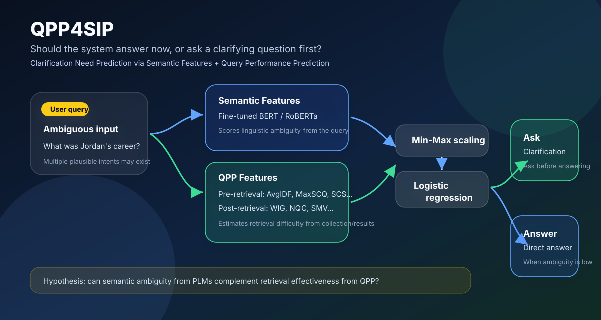
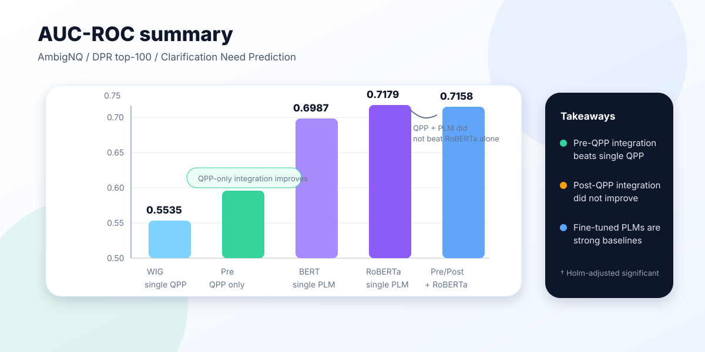

# QPP4SIP

**対話型検索における明確化必要性予測（Clarification Need Prediction）を、意味的特徴と Query Performance Prediction（QPP）の統合として検証する研究リポジトリです。**

  

## 何を扱う研究か

対話型検索や LLM ベースの検索応答では、ユーザーの入力が曖昧なままでもシステムがもっともらしい解釈を仮定して回答してしまうことがあります。これは過度な推測やハルシネーションにつながるため、システムには「今すぐ回答する」だけでなく、「先にユーザーへ明確化質問をする」判断が必要です。

この判断を二値分類タスクとして扱うのが **Clarification Need Prediction（CNP）** です。本研究では、次の 2 種類の情報を統合することで CNP の性能が改善するかを検証しています。

| 観点 | 何を捉えるか | 本研究での扱い |
| --- | --- | --- |
| 意味的特徴 | クエリそのものの言語的・意味的な曖昧性 | Fine-tuned BERT / RoBERTa の出力スコア |
| QPP | 検索システムから見た検索困難性・検索有効性 | Pre-retrieval / Post-retrieval QPP 指標 |
| 統合モデル | 異なるスコアの相補性 | Min-Max 正規化後、ロジスティック回帰で統合 |

研究上の問いは単純です。

> **PLM が捉える「クエリの意味的曖昧性」と、QPP が捉える「検索有効性」は、明確化質問の要否判定で相補的に働くのか？**

## 対象論文

この README は、以下の DEIM 2026 投稿稿の内容をもとに整理しています。

- 柴田大暉, 酒井哲也. **意味的特徴およびクエリ性能予測の統合に基づく対話型検索における明確化必要性予測**. DEIM 2026 投稿稿.

## 提案手法の概要

入力クエリに対して、PLM と QPP から複数のスコアを得ます。各スコアは値域や分布が異なるため、Min-Max 正規化で 0 から 1 の範囲にそろえます。その後、ロジスティック回帰で統合し、明確化が必要である確率を推定します。

$$
P(y = 1 \mid x) = \frac{1}{1 + \exp \left( - \left( \beta_0 + \sum_{j=1}^{m} \beta_j x_j \right) \right)}
$$

ここで、$y=1$ は「明確化が必要」、$y=0$ は「明確化不要」を表します。QPP 指標間には相関があるため、通常のロジスティック回帰に加えて L1 正則化、L2 正則化、ElasticNet も比較しています。

### 使用した特徴量

| 種別 | 指標・モデル |
| --- | --- |
| Pre-retrieval QPP | AvgICTF, AvgIDF, MaxIDF, MaxSCQ, Simplified Clarity Score |
| Post-retrieval QPP | Clarity, WIG, NQC, SMV, n(σ%) |
| Fine-tuned PLM | BERT, RoBERTa |
| 統合モデル | Logistic Regression, L1, L2, ElasticNet |

## 実験設定

| 項目 | 設定 |
| --- | --- |
| タスク | 明確化必要性予測（CNP） |
| データセット | AmbigNQ |
| ラベル | QA pair が 1 件なら `明確化不要`、2 件以上なら `明確化が必要` |
| 検索対象 | Wikipedia passage collection |
| 検索手法 | DPR による上位 100 件取得 |
| 評価指標 | AUC-ROC |
| 有意差検定 | DeLong 検定 + Holm 補正 |

## 主な結果

  

| 比較対象 | AUC-ROC | 読み取り |
| --- | ---: | --- |
| Best single QPP: WIG | 0.5535 | QPP 単体では識別力は限定的 |
| Pre-retrieval QPP 統合 | **0.5964†** | QPP のみでは統合により有意な改善が見られた |
| BERT 単体 | 0.6987 | Fine-tuned PLM は QPP より大きく高性能 |
| RoBERTa 単体 | **0.7179** | 実験中の最良単体モデル |
| Pre/Post/RoBERTa 統合 | 0.7158 | QPP を加えても RoBERTa 単体を上回らなかった |

† Holm 補正後、説明変数に用いた Pre-retrieval QPP 指標に対して有意差あり。

### 結論として分かったこと

1. **QPP だけを見ると、Pre-retrieval QPP の統合は有効でした。** それぞれの指標は弱いものの、複数の語彙統計量を組み合わせることで単体指標を上回りました。
2. **Post-retrieval QPP の統合は改善しませんでした。** 検索結果スコア分布を使う指標であっても、明確化必要性を直接捉えるには十分ではありませんでした。
3. **Fine-tuned PLM は強いベースラインでした。** BERT / RoBERTa は QPP を大きく上回り、単純に QPP スコアを追加しても性能は改善しませんでした。
4. **検索有効性と明確化必要性は同じではありません。** QPP は検索がうまくいきそうかを推定する指標であり、ユーザー意図が明確かどうかとはずれる場合があります。

## このリポジトリの読み方

この README は論文の概要を中心にしています。実装を追う場合は、研究上の役割ごとに以下を見ると全体像を把握しやすくなります。

| パス | 研究上の役割 |
| --- | --- |
| `QPP/` | Pre-retrieval / Post-retrieval QPP 指標の算出 |
| `SIP/FT-PLM/` | BERT / RoBERTa などの PLM fine-tuning とスコア出力 |
| `LogReg/LASSO/` | QPP・PLM スコアの統合、正則化付きロジスティック回帰、統計的評価 |
| `LogReg/MoE/` | クエリごとの動的統合を見据えた追加実験 |
| `dataset/` | AmbigNQ / INSCIT などの実験データ配置 |

## 今後の方向性

本研究の結果から、単純な数値結合だけでは PLM と QPP の相補性を十分に引き出せないことが分かりました。次の発展として、ラベルに依存しない統合、クエリ特性に応じて重みを変える動的統合、明確化質問の必要性予測から実際の質問生成までを接続する設計が重要になります。

## Keywords

Conversational Search / Clarification Need Prediction / Query Performance Prediction / BERT / RoBERTa / Logistic Regression / AmbigNQ
